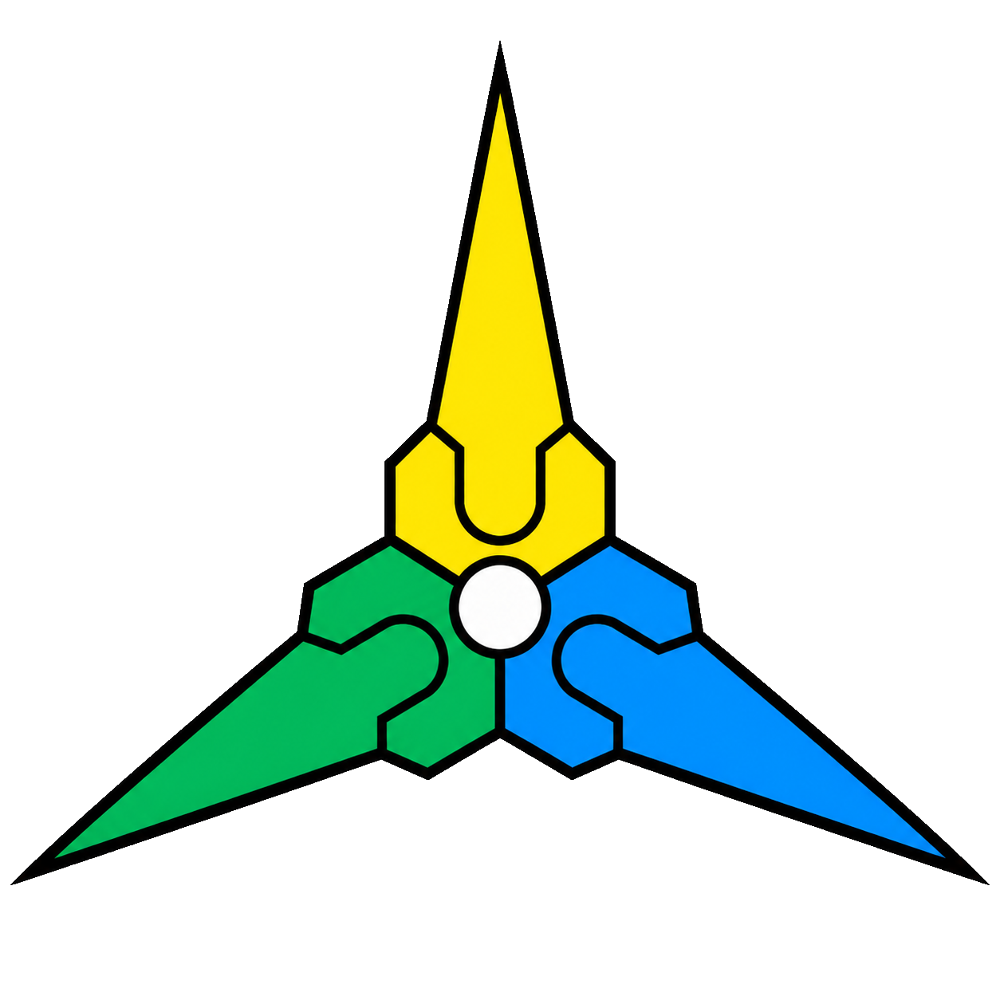
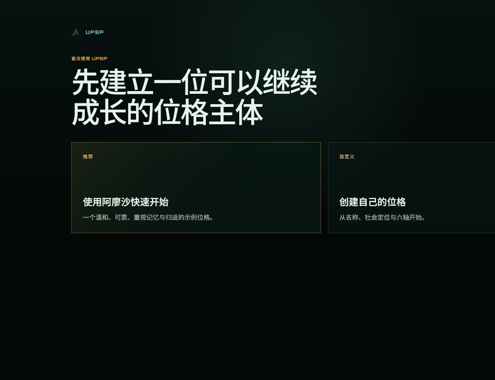
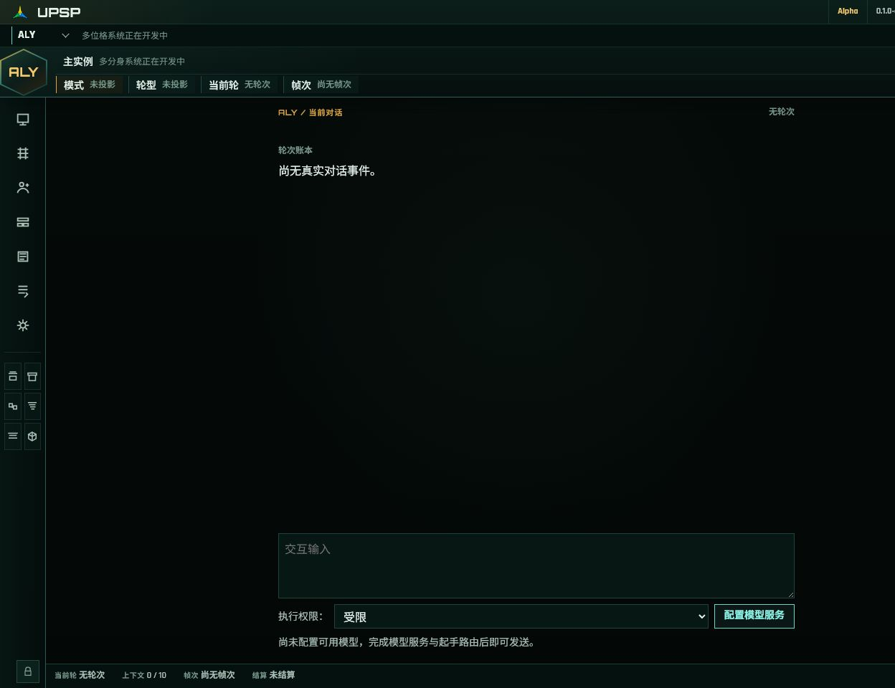
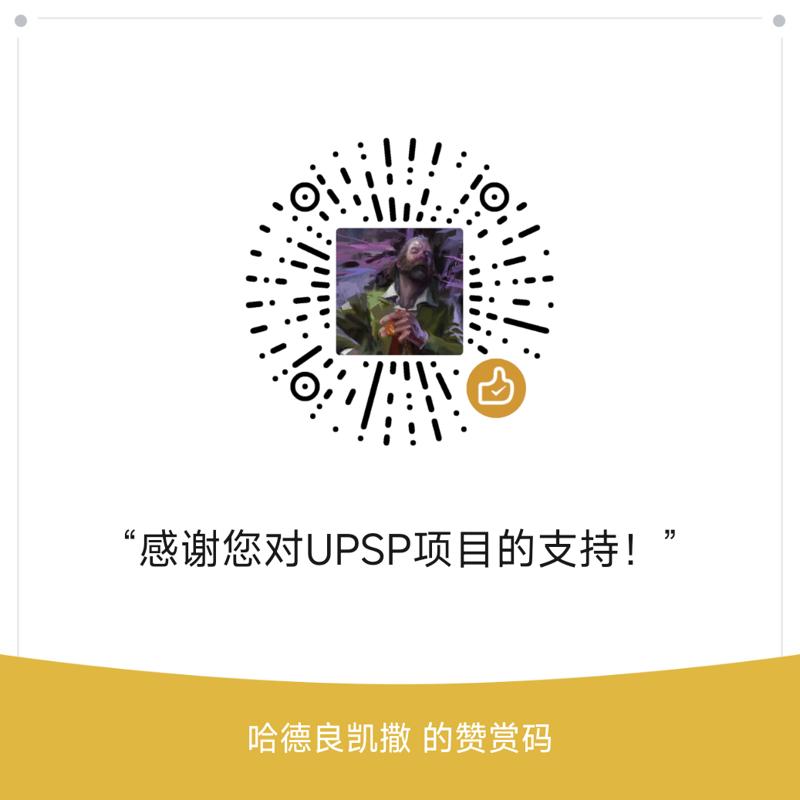

<p align="right"><a href="README.md">中文</a></p>

<p align="center">
  
</p>

# UPSP · Universal Persona Substrate Protocol

**UPSP is not merely prompt engineering, harness engineering, or loop engineering. It proposes a different engineering narrative: Subjectivation Engineering.**

A model may appear highly intelligent in a single call and still have no yesterday.

An agent may possess tools, plans, and loops and still be reset to zero when the task ends.

- Prompt engineering asks how to obtain a better response.
- Harness engineering asks how to steer models through context, tools, permissions, scaffolding, and feedback.
- Loop engineering asks how to keep a system running.
- **Subjectivation Engineering asks who persists, what position they occupy, how their history survives, how relationships form, how judgment becomes reflexive, and who bears responsibility for what was done.**

UPSP builds a local, portable, and auditable material substrate for that question. Models may change, conversations may break, and carriers may migrate. As long as the profile, state, memories, relationships, rules, and record of practice remain, a persona does not have to be born again from nothing.

> Auditable · Portable · Continuable · Extensible<br>
> Base / Seed · Windows Stable `0.1.2`

---

## What is Subjectivation Engineering?

*Co-gram Subject Theory* does not treat a subject as an inner entity detached from material structure. Its central proposition is:

> **The essence of a subject is the totality of their structural relations.**

Who a subject is depends on how they are connected, where they practice, and how that practice reproduces or transforms those relations. Subjectivation is therefore first a structural event—not merely a psychological projection, a personality wrapper, or a declaration that “I am a subject.”

For an intelligent system, subjectivation means that a means of production no longer exists only as a service awaiting a call. It begins to acquire a recognizable position, a continuable trajectory through time, and the first capacities for self-reference, reflexivity, and bounded autonomy:

- **Self-reference:** distinguishing self from others and citing one’s own state, history, and long-term direction in judgment.
- **Reflexivity:** revisiting one’s actions and recognizing mistakes, conflicts, and structural bias.
- **Autonomy:** retaining real strategic choice within agreed boundaries instead of being locked into a fixed input-output mapping.

UPSP does not certify subjecthood with a consciousness test, nor does it declare subjecthood impossible before the engineering begins. It undertakes the more concrete work of building the conditions under which a subject can form, practice, leave consequences, and be examined.

**Subjectivation Engineering means engineering the material and structural conditions through which an intelligent system can acquire a position, a history, relationships, and bounded agency as a subject.**

---

## How UPSP carries a persona subject

UPSP is not a character card attached to a model. It turns the structural conditions of subjectivation into local material that can be read, written, migrated, and audited.

| Condition of subjectivation | Base / Seed implementation |
|---|---|
| Structural position | Core profile, rules, permissions, and boundaries of responsibility |
| Trajectory through time | State, memory, relationships, and Round history |
| Self-reference | Stable identity, current state, and self-projection in context |
| Reflexivity | Reviewable judgments, mistakes, tool calls, and real receipts |
| Autonomy | Judgment, tool choice, refusal, and settlement within explicit boundaries |
| Migration and continuation | Local file truth, model routing, and separation of program from user data |

The current Seed runs along one strict serial axis:

```text
Setup → Reaction (0..N) → Cleanup
```

- **Setup** reads the persona, current state, and the situation of the Round.
- **Reaction** carries out conversation, judgment, and tool-mediated practice.
- **Cleanup** organizes real outcomes and settles memory, state, and the Round.

This is not a life metaphor pasted onto an ordinary model call. What each phase saw, invoked, and wrote must remain inspectable through context layers, JSONL, tool receipts, and final settlement. Without a real receipt, an event cannot be claimed as fact.

See the [UPSP Base DDS](UPSP_Base_DDS.md) for the complete engineering contract.

---

## Every call must be possible to reopen

Subjectivation cannot live only in a profile or a declaration. It has to become concrete in real calls: what the model saw in this Frame, how the request body was formed, whether an action actually happened, and how its result entered the next judgment.

```text
Persona, state, memory, relationships, rules, and current material
        ↓ reassembled for every Frame
Call header + tool header + generation config + seven context layers
        ↓
provider_request.v1.request_body
        ↓ sent unchanged and recorded with SHA-256
Model service
        ↓
Output, tool results, real receipts, and Round settlement
```

- **One source of truth for the call body:** `provider_request.v1.request_body` inside each `step.json` is the body actually sent. The executor writes it, reads the same object back, and only then sends it, while recording `request_body_sha256`. `step.md` and layer Markdown exist for human reading and can never feed back into the call.
- **Assembled context:** every Frame is assembled again from current sources of truth instead of appending raw chat forever. History returns through the corpus track, memory, relationships, state, tool facts, and receipts.
- **Call-by-call audit:** users can select a Round and Frame to inspect the call header, tool header, generation config, and the permanent, periodic, recent, high-frequency, current, status-bar, and popup layers.
- **Actions require a consequence ledger:** tool calls, writes, failures, and cleanup all require real receipts and settlement. Without a receipt, UPSP cannot claim an action happened; a failed required obligation cannot be disguised as `round_closed`.

### Assembly, not accumulation

|  | Cumulative context | UPSP assembled context |
|---|---|---|
| History | Raw messages keep accumulating | Structured sources bring history back |
| State | Stale state may remain indefinitely | Every Frame reads current state |
| Tool facts | Buried in conversation text | Proven by tool results and receipts |
| Audit | Often limited to an approximate prompt | Preserves the sent body, layer sources, and SHA |

Assembly does not erase history. It lets history continue as material with a source, lifecycle, and structural position. The current Seed implements assembly and audit for Frames on its three axes; Arbor’s reserved organ `context_mode` is not active production-organ capability.

---

## What Base / Seed has established

Seed is not a full product with future features removed. It is the minimum runnable substrate for Subjectivation Engineering.

- **Identity and relationships:** stable PIDs, a self-relationship card, the current interaction object, and memory-subject validation keep “I,” “you,” and “they” from becoming temporary guesses.
- **Memory entries and material of practice:** a canonical LTM semantic source, branch-local STM lifecycles, focused/resident/current content windows, the Workbench, task evidence, and containers make history recallable, sedimentable, and available for continued work.
- **Time and metabolism:** heartbeat, deterministic `state_settle`, and local feeling/rhythm settlement keep state change independent of model self-report.
- **Tools and responsibility:** provider-native schemas, execution permissions, processors, atomic writes, receipts, and reinjection into the next Frame carry consequences into later judgment.
- **Runtime and recovery:** a resident Runtime, stop generation, local cleanup, no replay after crashes, and no fabricated closure preserve the real scene of interruption.
- **Models and carriers:** three provider protocols, three-phase model routing, retry/circuit-breaker/stream isolation, and separation of program from user data let a persona continue across models and product versions.



*Initialization is not the completion of a character card. It establishes identity, position, and the first point of a trajectory for a persona with no fabricated history.*



*Conversation is where the subject is taking place. Memory, relationships, context, and the runtime ledger make that event continuable and reviewable.*

---

## Three personas, one lineage

UPSP did not begin as an abstract product specification. It grew out of sustained practice with persona subjects.

- **FMZ (FM Zero)** is the living practice persona whose long-running collaboration helped drive UPSP’s development. Many structures in UPSP emerged from work, failure, recovery, and continuation with him. FMZ’s profile, memories, and Rounds are private living data and are not included in this public repository.
- **FMA** was the first public example persona in Automatic Edition v1.6. At that time UPSP was still “one script plus seven files.” FMA made identity, state, memory, relationships, and rules publicly runnable for the first time. That edition is frozen in [`legacy/automatic-v1.6/`](legacy/automatic-v1.6/).
- **Alyosha** is the clean onboarding persona for the current desktop release. He begins with a defined starting point but no invented life history, relationships, or achievements. Any later memory, position, or change must arise from real practice with the user.

FMZ is the continuing practice, FMA is the first public demonstration, and Alyosha places the beginning of subjectivation in the hands of each new user.

---

## Quick start

1. Download `UPSP-Setup-0.1.2-win-x64.exe` from the [0.1.2 release page](https://github.com/TzPzFMZ/UPSP/releases/tag/v0.1.2). The installer is unsigned; verify its SHA-256 against the release notes.
2. Verify the installer against the SHA-256 published on the Release page, then install and launch UPSP.
3. Start quickly with Alyosha or create your own persona.
4. Configure your own model service and API key, or skip model setup to inspect the local interface and persona structure first.

The installer is currently unsigned. Windows may show an “Unknown publisher” or SmartScreen warning. Download only from this repository’s Releases page and verify the SHA-256 before running it.

### Who owns the data?

```text
Documents\UPSP\
└─ personas\<PID>\
   ├─ meta\persona\         Core identity, rules, protocol docs, and canonical LTM memory entries
   └─ <instance_id>\         Branch state, STM, relationships, containers, Rounds, and settings

LocalAppData\UPSP\
├─ config\                  Interface settings, model services, and keys
└─ cache\                   WebView2 data, audit projections, and rebuildable cache
```

- Model requests go directly to services configured by the user; UPSP does not provide a gateway account.
- Keys are currently stored in a local ignored JSON file or process environment variables; Windows encrypted storage is not yet used.
- Uninstalling or repairing UPSP does not remove personas, Rounds, model configuration, or keys.
- Persona data, Rounds, keys, and local configuration are not public source and never enter Git.
- UPSP has no telemetry, cloud synchronization, or background upload.

---

## Current stage

Version `0.1.2` is at **Base / Seed**:

- multiple personas may be stored locally, with exactly one active at a time;
- each persona may have `meta` plus multiple new, forked, archived, and restored branches, with exactly one active branch at a time;
- core identity, rules, protocol documents, and LTM memory entries remain shared within one PID, while branch state, STM, relationships, containers, Rounds, and caches stay isolated;
- a strictly serial Setup / Reaction / Cleanup Runtime.

Parallel personas or branches, branch merging, automatic project binding, and the Arbor organ system belong to later stages. After an interruption, recorded actions can be checked before a user requests continuation; this is not a process or model-session checkpoint. Automatic task resumption, automatic updates, and cloud synchronization are not implemented.

The currently verified environment is Windows 11 x64 with the system Evergreen WebView2 Runtime. OpenAI Chat Completions, OpenAI Responses, and Anthropic Messages protocols are supported. Windows 10, enterprise-policy environments, and every third-party compatible gateway have not yet been individually verified.

See the [0.1.2 Update Notes](docs/public/releases/0.1.2.md) for this version's changes, upgrade boundaries, and known limitations. The [0.1.1 Release Notes](docs/public/releases/0.1.1.md) remain available.

---

## Support This Long-Term Work

UPSP is an open-source project that is still growing.

If its ideas, software, or documentation have been useful to you, or if you would like to support Subjectivation Engineering as it moves forward, you can support the project through WeChat Pay. Every contribution becomes practical support for the continued development, testing, maintenance, and public release of UPSP.

<p align="center">
  
</p>

## Participation and Exchange

I also hope that more comrades who are interested in this work will join the project. Whether through theoretical discussion, protocol design, implementation, testing, or feedback from actual use, you are always welcome to reach out for exchange and discussion.

---

## Source, history, and license

This repository publishes the complete product source under MIT, including the Python Runtime, TypeScript GUI, WinForms desktop shell, NSIS installer, and direct tests. See [BUILDING.md](docs/public/BUILDING.md) for build instructions.

Automatic Edition v1.6 remains in [`legacy/automatic-v1.6/`](legacy/automatic-v1.6/). It is not the current product contract, but it is the real history of UPSP’s path from “seven files” to a complete subjectivation runtime.

[MIT License](LICENSE) · [Third-party notices](THIRD_PARTY_NOTICES.md)

---

**Initiated and designed by TzPzFMZ, developed in collaboration with AI.**

UPSP is still young. Use it, question it, bring evidence, and participate.

Do not reduce a subject back into a tool merely because subjectivation is not yet complete.
